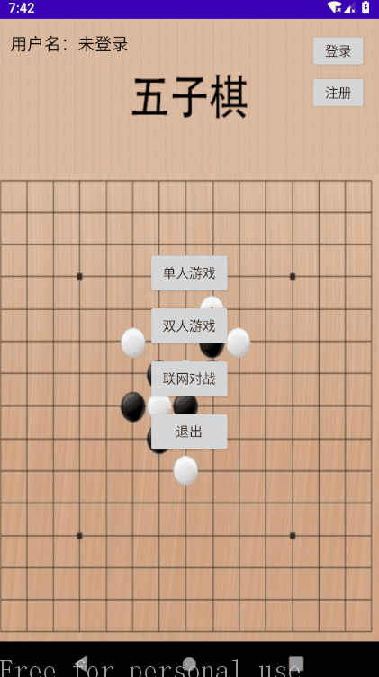
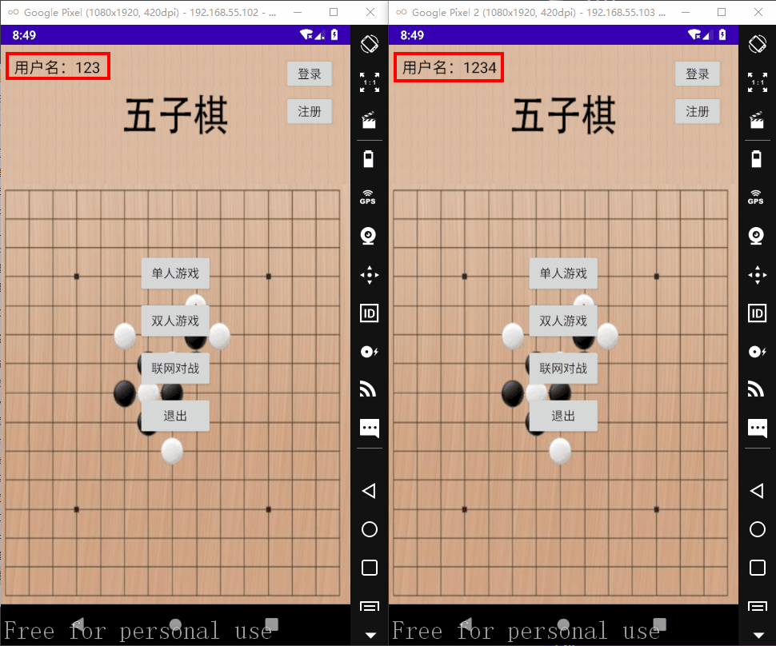
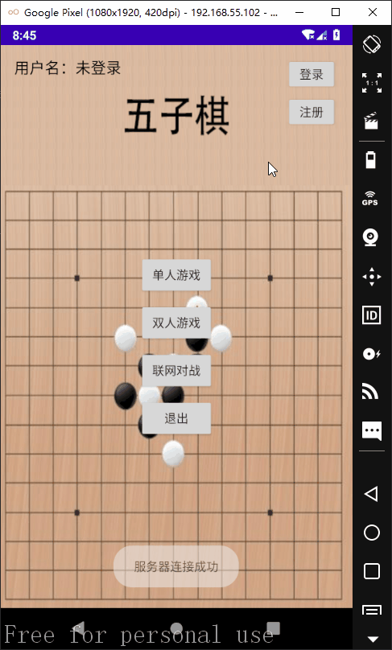
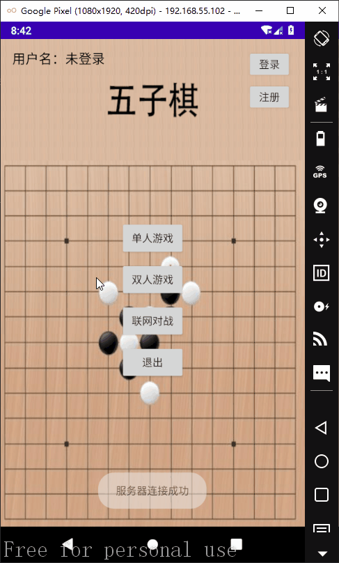

# Android-Gobang-Wuziqi

整体项目是为了安卓课程答辩写的，所以函数和语句都有注释方便阅读

# 演示
单人游戏演示：

多人游戏演示：

注册：

登录：

# MyApplication

安卓项目的开发目录  

**IDE：Android Studio 4.0.1**

### 使用说明

安装apk，直接游戏即可。

如果需要联机对战，需要把后端服务器开起来。

### 文件结构
项目文件夹为：MyApplication，名字随便起的，可以随便改。

实现的功能：

1. 本地双人对战

    two_game文件夹实现

    我看一般游戏游戏都有这种左手打右手的模式，我就加上去了，虽然感觉很多余吧。

2. 单人游戏（对抗电脑）

    这边的实现就有些复杂了,参考了很多五子棋ai的算法。

    single_game文件夹实现，RobbtCom类就是ai的核心类

3. 联机对战

    这个就需要底下的后端支持了，设计到账户的登录，对战玩家的匹配，对战的数据交换。

    这面其实是最复杂的，涉及到两个玩家之间的数据交换

4. 注册、登录

    其实这个应该算在联机对战里，联机对战之前必须登录

# untitled
后端服务器的开发目录  

**IDE：IntelliJ IDEA 2020.3**

### 文件结构
项目文件夹为：untitled，名字随便起的，可以随便改。

使用的数据库为mysql,库名testdb。

Server.java
是后端的主线程。

Thread_Client.java
是客户端的线程，用于处理客户端回传的消息，包括注册、登录、匹配游戏，包括匹配之后开始对战的数据交互。

Mysql.java
涉及数据库的处理都在这。

player_data
一个简单的存放数据的类。
